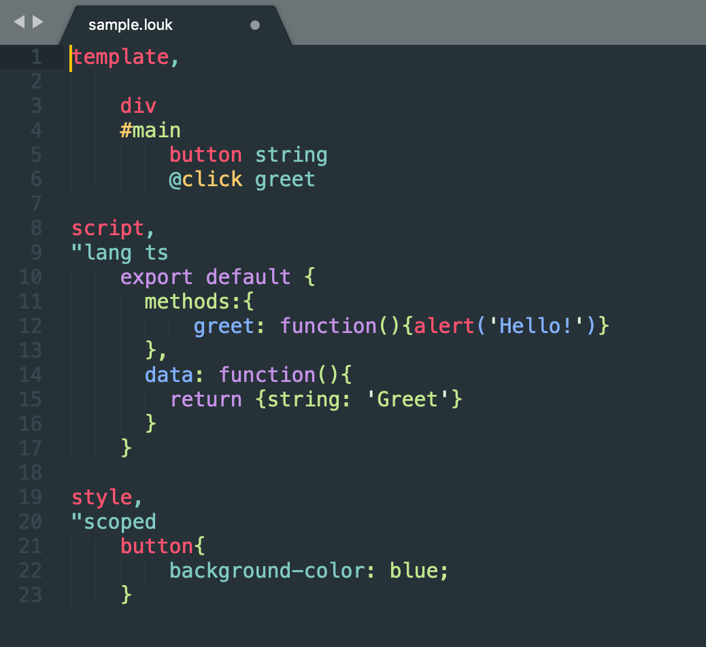

# Louk Grammar
Syntax highlighting for [Louk](https://www.louk-lang.org)


## Installation
```sh
apm install language-louk
```

## About
This package/repository is purely a distribution mechanism for build outputs from the [louk-grammar](https://github.com/agorischek/louk-grammar) repository. Contributions and modifications should be made in that repository.

